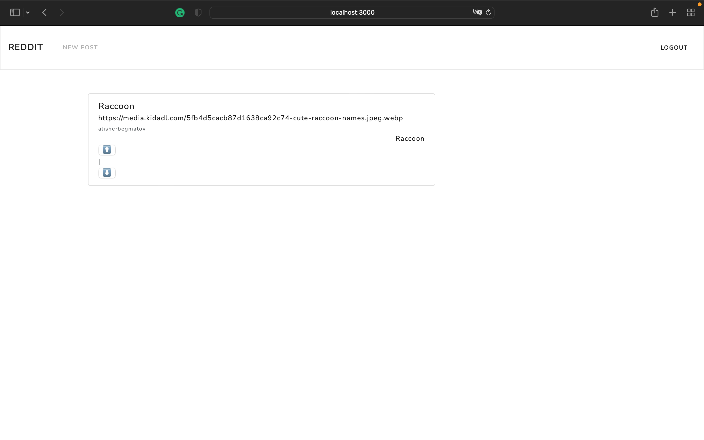

# Reddit

<p align="center">

</p>

## Built With

- [HTML](https://en.wikipedia.org/wiki/HTML)
- [Node](https://nodejs.org/en/)
- [Handlebars](https://handlebarsjs.com)
- [Bootstrap](https://getbootstrap.com)

## Getting Started
1. In order to clone the repository to your local machine, run the following command below or click the green Code button on the top right corner of the repository and then select Open with GitHub Desktop option or select Download ZIP option.
```zsh
git clone https://github.com/alisherbegmatov/reddit.git
```
## Installation
2. Open the project in the text / code editor of your choice and in the terminal, run the following command below:
```zsh
npm i or npm install
```
## Run
3. After installation of the required packages / dependencies, in the terminal, run the following command below:
```zsh
node app.js
```
4. In the terminal, open (Command + Click) [http://localhost:3000](http://localhost:3000) to run the project on your local machine in the default browser.

## License
Distributed under the MIT License. See LICENSE.txt for more information.
